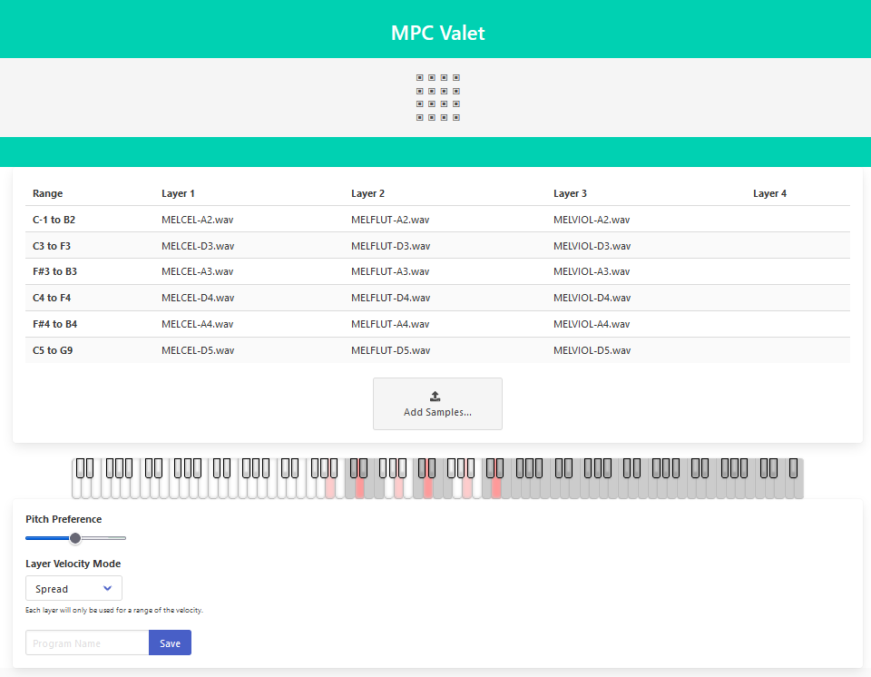

# MPC Valet

[MPC Valet](https://plule.github.io/mpc_valet/) is a helper to create instruments that can run on MPC X, Live, One.

These instruments are called "Keygroup Program" (or multisample program). They are built from a set of audio sample, such as notes
of a piano. Each audio sample is assigned a note range, and can then be played as a piano.

MPC Valet is intended to make the initial process of loading all the samples and assigning the ranges easier. You can just
drag and drop a set of samples in the UI and it will:

 - Auto-detect the root note based on the sample name
 - Find appropriate ranges for each root note
 - Export an MPC program ready to be loaded on the actual machine

It does not expose nearly all the possible options to create such an instrument, but is rather intended
to ease the initial painful setup of the samples. The created programs will always need fine tuning on MPCs.
